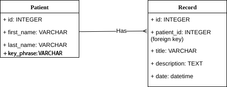

# Code 301 Final Project "Med Words" (version 1.0.0)

**Team Members** - Aaron Frank, Jeff Weng, Kendra Ellis, Tre Cain

**Deployed Site**: (http://medwords.info/)

>### Project Description
This app is a proof of concept/prototype. The development team wanted to work with one of Microsoft's APIs with a focus on health care, so we brainstormed a project that combines the two. 

Our medical histories are increasingly pieced together from records created by different providers at different clinics and hospitals. Parsing a patient's medical history from such long, motley charts is time consuming; clinicians may not have the time to thoroughly 'read' a patient's history unless diagnosis or treatment necessitates. Moreover, when searching a patient's chart for specific terms like "hypertension" or "hypercholesterolemia," the clinician is only presented with records that match those terms.

We envisioned another way of reading a patient's history by analyzing a patient's chart (comprised of individual records) for key phrases. Med Words presents those key phrases to clinicians in a condensed format so that a new PCP can see major themes in a patient's history at a glance.

>### Problem Domain
Electronic Medical Records, Patient History Information Transfer, Knowledge Extraction, Natural Language Processing

>### Requirements
* Node.js
* dotenv: 6.0.0
* ejs: 2.6.1
* express: 4.16.3
* method-override: 3.0.0
* pg: 7.4.3
* superagent: 4.0.0-beta.5
* API key for Microsoft Text Analytics

>### How To Use Our App
Development: Create a Node instance and clone the repo.
As a User: Navigate to (http://medwords.info/), select a patient or create a new patient, create or view a patient's records, send those records off for key phrase analysis and view the key phrases.

>### Database Schema

>### Site Endpoints
* **GET /** - This route redirects the user to the '/patient' main page
* **GET /about** - This route renders the About page
* **GET /patient/:patientId** - This route queries the site DB for the patient's demographic info and records. It then renders the Patient Detail Page with the information retrieved from the DB.
* **GET /record/:patientId/:recordId** -  This route queries the database for a specific record's details and renders the Record Detail Page.
* **GET /patient/:patientId/analyze** - This route sends a POST request to the MSFT Text Analytics Key Phrases API with all of a patient's record title+descriptions. After retrieving the key phrases, it counts the occurrences of each phrase and renders the Key Phrases page. The route also makes a PUT request to the site's DB to save the top key phrases in html markup in the patient's row of the DB. When navigating back to the Patient Detail Page, the top key phrases will appear below the patient's name.
* **POST /patient** - Inserts a new patient to database and redirects to new patient detail page with a success message.
* **POST /record** - Inserts a new record into the database with the current date and redirects to new record detail page with a success message.
* **DELETE /patient/:patientId** - This route will delete a patient and their records from the database and redirect to the main page with a success message.
* **DELETE /record/:recordId** - This route will delete a record from the database and redirect to the patient detail page with a success message.

>### Credits and Collaborations
Microsoft Text Analytics Key Phrases API

W3Schools dynamic list filter function

Sample chart notes (https://www.med.unc.edu/medselect/resources/sample-notes)
